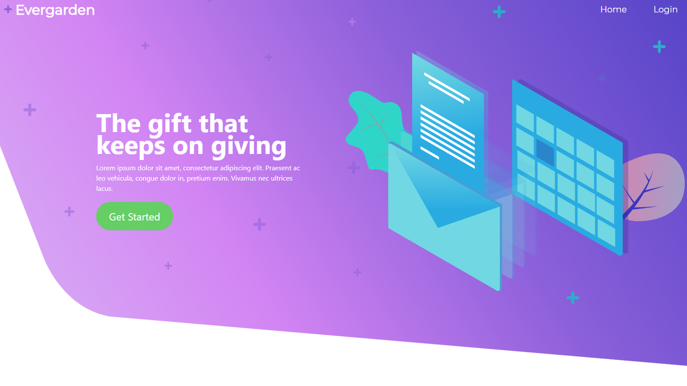

# Evergarden Services

Our goal with this project was to allow you to make connections with those that you care about. 

#### Check it out [here](https://evergardenservices.herokuapp.com/).

## Built With

* [React](https://reactjs.org/) - The JavaScript library used
* [Express](https://expressjs.com/) - Server Framework
* [Passport](http://www.passportjs.org/) - User Authenticationn
* [NodeMailer](https://nodemailer.com/about/) - Module to send emails
* [Mongoose](https://mongoosejs.com/) - Structure to Database
* [Node-cron](https://www.npmjs.com/package/node-cron) - Task Scheduler

## Authors

* **Eric Nguyen** - *Initial work* - [enguyen93](https://github.com/enguyen93)
* **Conner Rhodes** - *Initial work* - [Crhodes92](https://github.com/Crhodes92)
* **Joshua Berrios** - *Initial work* - [joshllopart](https://github.com/joshllopart)
* **Carlos Barahona** - *Initial work* - [Sapulsic](https://github.com/Sapulsic)
* **Niko Roberts** - *Initial work* - [dvld](https://github.com/dvld)

See also the list of [contributors](https://github.com/enguyen93/EvergardenServices/graphs/contributors) who participated in this project.
